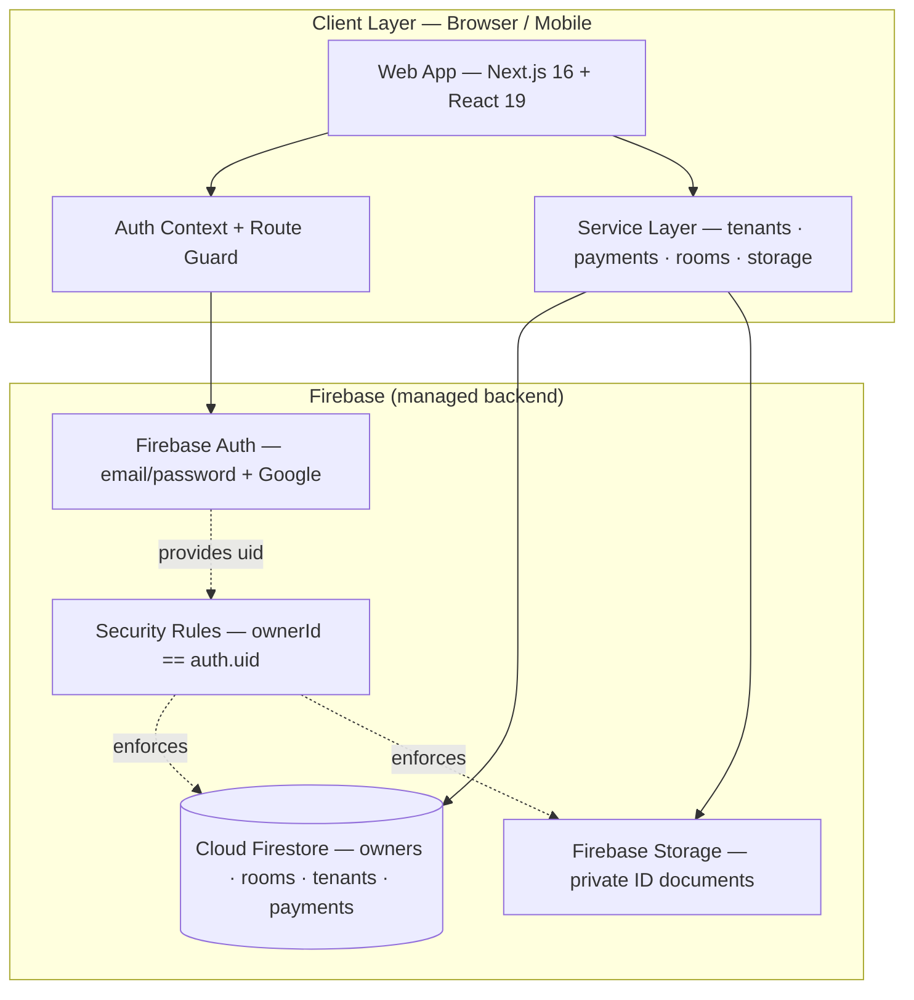
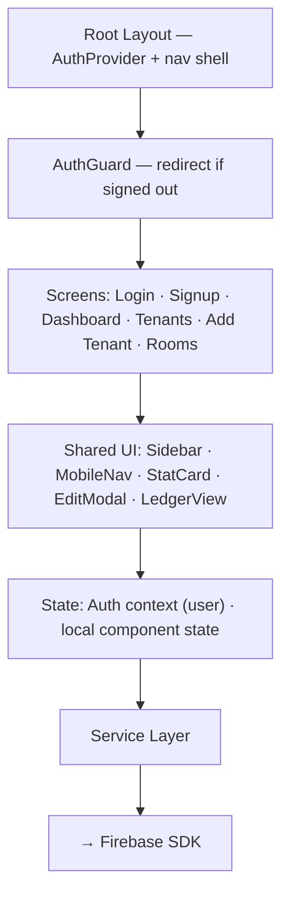
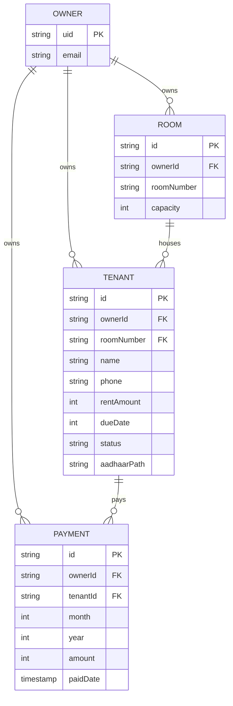
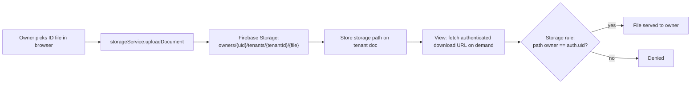
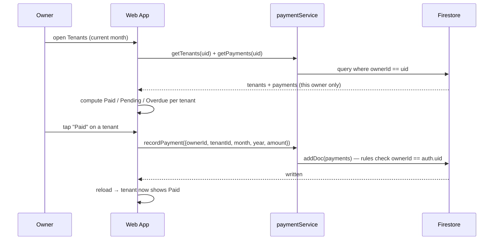
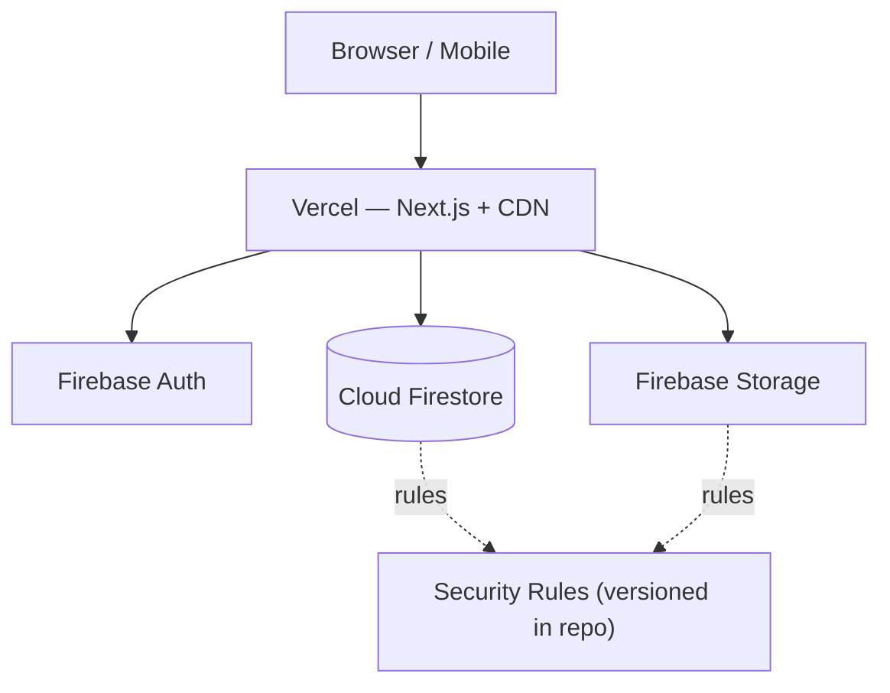
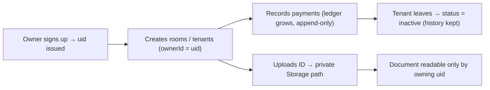

# PG Manager — System Architecture

**Status:** Draft v1 · **Last updated:** 2026-07-22

This document describes how PG Manager fits together. It reflects the intended design; sections marked _(planned)_ are not yet implemented. Rationale for the technology choices lives in [decisions.md](decisions.md); the concrete data shapes live in [data-model.md](data-model.md).

---

## 1. Design Principles

1. **Firebase-native & serverless.** There is no custom API server. The Next.js client talks directly to managed Firebase services. This keeps the surface small and the ops burden near zero — the right trade for a solo-built tool.
2. **Security rules are the backend.** Because the browser talks straight to the database, the trust boundary is the Firestore/Storage rule set. Every read and write is validated server-side against the signed-in owner. The client is treated as untrusted.
3. **Owner-scoped by construction.** Every domain document carries an `ownerId`. Queries filter by it and rules enforce it, so one owner can never see or touch another's data.
4. **Privacy-first for IDs.** Tenant Aadhaar/ID documents are PII. They live in private, per-owner Storage paths — never a public URL, never in source control.
5. **Mobile-first.** Owners run their property from a phone. The UI is responsive with a bottom nav on mobile and a sidebar on desktop.

---

## 2. System Overview



The client is thin but structured: an **auth context** owns the session and guards routes, and a **service layer** is the only place that touches Firestore/Storage. Firebase is the entire backend, with **security rules** as the enforcement layer sitting in front of the database and file storage.

---

## 3. Frontend

Next.js (App Router) + React + Tailwind. Client components throughout, because the app is inherently interactive and personalized to the signed-in owner.



Key decisions:
- **Client-side route protection.** The auth context exposes the current owner; an `AuthGuard` redirects unauthenticated users to `/login`. Next.js 16 deprecates `middleware` in favor of `proxy`, and Firebase Auth tokens live client-side, so guarding in the client is both simpler and correct here (see [decisions.md](decisions.md) ADR-006).
- **Service layer isolation.** UI never calls the Firebase SDK directly; it calls `services/*`, which inject the current `ownerId`. This keeps scoping consistent and swappable.

---

## 4. Authentication

Firebase Auth with two providers: email/password and Google. Sign-in establishes the owner identity (`auth.uid`) that scopes all data.

```mermaid
sequenceDiagram
    participant U as Owner
    participant FE as Web App
    participant AUTH as Firebase Auth
    participant FS as Firestore

    alt Email / password
        U->>FE: enter email + password
        FE->>AUTH: signIn / signUp
    else Google
        U->>FE: click "Continue with Google"
        FE->>AUTH: signInWithPopup(Google)
    end
    AUTH-->>FE: user credential (uid, token)
    FE->>FE: AuthContext stores user; guard unlocks app
    Note over FE,FS: Every subsequent read/write carries the uid;<br/>rules check ownerId == auth.uid
    FE->>FS: query where ownerId == uid
    FS-->>FE: only this owner's documents
```

The auth token is attached automatically by the Firebase SDK on every request, so rules can evaluate `request.auth.uid` without the app managing tokens by hand.

---

## 5. Data & Ownership Model

Firestore holds four owner-scoped concerns. Every document stores `ownerId`, and queries always filter by the signed-in owner.



- **Rooms** are first-class: a room has a `capacity` (beds). Occupancy is derived by counting active tenants whose `roomNumber` matches — no denormalized counter to drift out of sync.
- **Payments** are an **append-only ledger**. A tenant's status for a month is computed by checking whether a payment exists for that month/year — this preserves history and supports future reporting, unlike a single boolean flag.

Full field-level shapes and constraints → **[data-model.md](data-model.md)**.

---

## 6. Secure Document Storage

Aadhaar/ID files never touch a public folder. They live in Firebase Storage under an owner-scoped path and are readable only by that owner.



Only the **storage path** is persisted on the tenant document, not a public link. A download URL is requested on demand while the owner is authenticated, and the Storage rule confirms the path's owner segment matches `auth.uid`. This replaces the original design, which wrote files into `public/` and served them at guessable public URLs (see [decisions.md](decisions.md) ADR-005).

---

## 7. End-to-End Flow — Record Rent

The everyday happy path: an owner marks a tenant paid.



---

## 8. Deployment _(planned)_



| Concern | Approach |
|---------|----------|
| Frontend | Vercel (CDN, preview deploys per PR) |
| Backend | Managed Firebase (Auth, Firestore, Storage) — no servers to run |
| Config | Firebase web config via `NEXT_PUBLIC_*` env vars |
| Security | Rules deployed from `firestore.rules` / `storage.rules`; least-privilege by owner |
| Secrets | No server secrets; Firebase web config is public by design, protected by rules |
| CI/CD | Push → Vercel build/deploy; rules deployed via Firebase CLI |

---

## 9. Trust Boundary & Data Lifecycle



The security rules are the single trust boundary: because the app is client-only, correctness of isolation depends entirely on rules that check `ownerId == auth.uid` on Firestore and match the owner path segment on Storage. Tenant history is preserved on departure (soft-delete via `status`), and ID documents remain private to the owning account for their lifetime.
